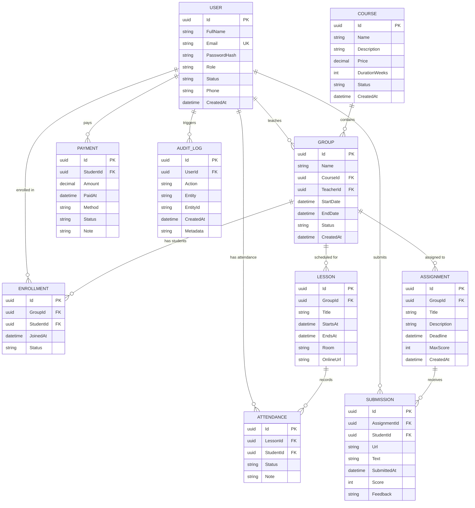

# EduFlow — Ma'lumotlar Modeli (ERD)

Ushbu hujjat EduFlow tizimining ma'lumotlar bazasi munosabatlarini (Entity-Relationship Diagram) ifodalaydi.

### Indekslar va Cheklovlar (Constraints)
- `User.Email`: Unique index
- `Enrollment(GroupId, StudentId)`: Unique composite index (bitta o'quvchi bir guruhga ikki marta yozilishi taqiqlangan)
- `Attendance(LessonId, StudentId)`: Unique composite index
- `Submission(AssignmentId, StudentId)`: Unique composite index
- `Lesson(Room, StartsAt, EndsAt)`: Darslar to'qnashuvi (Room / Teacher conflict) validatsiyasi
